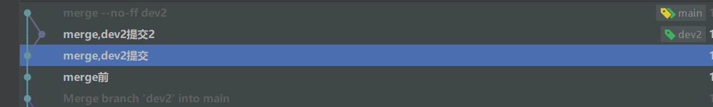

# git学习

由于之前使用svn,最近改用git,虽然也用过一段时间git,但这前大部分时候都是在单人使用github,因此在这里好好学习一下git的相关操作,并对git的操作进行总结.


## 1.git和svn的区别

之前用过svn的可以参考此段.

## 1.区别

[此表格出处](https://www.cnblogs.com/pawn-i/p/11898038.html)

|                      | Git(分布式版本控制系统)                                      | Svn(集中式版本控制系统)                                      |
| -------------------- | ------------------------------------------------------------ | ------------------------------------------------------------ |
| **工作流程**         |  1.写代码2.提交到本地版本库3.从服务器拉回服务器的当前版本库，并解决服务器版本库与本地代码的冲突4.将远程库与本地代码合并结果提交到本地版本库5.将本地版本库推到服务器 | 1.写代码2.从服务器拉回服务器的当前版本库，并解决服务器版本库与本地代码的冲突3.将本地代码提交到服务器 |
| **是否有中央服务器** | 没有中央服务器，开发人员本地都有 Local Repository            | 有。开发人员需要从中央服务器获得最新版本的项目然后在本地开发，开发完推送给中央服务器。因此脱离服务器开发者是几乎无法工作的 |
| **网络依赖 **        | 分布式在没有网络的情况下也可以执行commit、查看版本提交记录、以及分支操作，在有网络的情况下执行 push 到 Remote Repository。 | 必须要联网才能工作，而且对网络的依赖性较强，如果推送的文件比较大而且网络状况欠佳，则提交文件的速度会受到很大的限制。 |
| **分支操作影响**     | 分支操作不会影响其他开发人员                                 | 创建新的分支则所有的人都会拥有和你一样的分支                 |
| **提交过程**         | 提交是本地操作，需要执行push操作才会到主要版本库             | 提交的文件会直接记录到中央版本库                             |

## 2.理解

在表格中我们看到Git是分布式版本控制系统,而svn是集中式,我们可能会奇怪,svn我们也是多人在不同的电脑上协作啊,但是理解了两者的区别,我们就会发现,svn只有一个中央库,存放在中央服务器中,而git有多个仓库,我们每个人都有自己的个人仓库,也可以创建多个分支.

我们可以这样理解:svn有一个中央库,我们的一切操作都要和svn的中央库挂钩,当我们没有网络了,我们无法提交,也无法查看日志,我们做的一切都服务于svn中央库,而git我们每个人都有自己的库,即使没有网络,我们也可以提交,可以回滚,可以查看日志,当我们想和远程库进行操作的时候,只需要push即可,远程库相当于一个媒介,帮助我们和别人进行沟通交流,但没有远程库,我们自己也可以使用git

svn和git的操作也有不同:

- svn 我们想提交的时候,add 新文件(此步骤可以放在后面的解决冲突处执行),然后需要pull最新代码,然后本地解决冲突,然后commit

- git 我们提交的时候,add(和svn不同,新文件和修改的文件都需要add操作),然后commit,然后

然后pull,然后解决冲突,最后push

svn每一次提交都要解决冲突,而git只有我们push的时候才需要解决冲突(单一分支操作),对于git我们可以将一个功能的每一次修改都commit一次而无需解决冲突,知道整个功能开发完成,我们再进行最终的push

## 2.git的分区


| 新增文件不在四个区当中 | add--->暂存区     |
| ---------------------- | ----------------- |
| 工作区                 | add--->暂存区     |
| 暂存区                 | commit-->本地仓库 |
| 本地仓库               | push--->远程仓库  |
| 远程仓库               |                   |


## 3.git一个完整的操作

下面介绍一个git的完整的提交操作流程

```
1.git add                     //(.或者按文件add) 此步骤的目的是为了将我们想要的文件添加到暂存区
2.git commit -m commit的内容   //此处我们提交了一个版本,并想将这个版本push到远端
3.git stash                   //比如说我们同时开发两个功能,现在我们另一个功能还没做完,只想提交一个功能,怎么办?使用git stash命令,将代码暂时存放起来(注意:这些代码不在暂存区),此时工作区的代码和暂存区的代码都会被隐藏起来(注:新增的文件也想隐藏需要使用git stash -u)
4.git pull    
5.解决冲突,此时如果产生冲突需要我们再提交一份解决冲突的版本
6.git push                   //此时推送远端成功,push的是 提交版本+解决冲突版本
7.git stash pop              //将不想提交的文件恢复出来
8.继续解决冲突      
```

## 4.git操作-->对应命令

此处以操作介绍命令,而第5章节将单独介绍命令,4,5章节可能会包含重复内容

### 1.git  拉取线上的仓库

```git
git clone 远程库地址
```

### 2.git 提交单次文件

```
1.修改文件
2.git add .                                //此处提交文件到暂存区,可以提交多个,也可以提交一个
3.git commit -m 此处添加更新的备注            //此处提交文件到本地仓库
4.git push                                 //此处提交文件到远程仓库
```

#### 1:git提交需要注意

- `git新增文件的操作和git修改文件的操作相同`,没有任何多余的其他步骤

-  `git提交的时候只会提交暂存区的文件`

#### 附1: git add

在使用svn的时候,我们使用新增文件的时候 需要先add文件后提交,而更新的文件只需要commit即可
而在git当中,新增的文件git也默认添加了,但是新增和修改的文件都需要 add 添加到暂存区这一步骤

#### 附2: Untracked files:

git untracked files 实际上就是新增的文件,当我们使用add的时候,它会直接提交到暂存区,此处一定要记住和svn新增文件的不同之处

使用git status 和git status -s 我们可以看到git 文件的状态


#### 附3:git reset 

git reset 可以将我们提交到暂存区的文件重新返回去

### 3.git 多次提交文件

```
修改--->add--->commit
修改--->add--->commit
git push                                      //此时我们直接push两次commit,远端可以看到两次的日志
```


### 4.git pull

##### 1.本地无修改,无冲突

无需操作

##### 2.本地有修改,无冲突

无需操作

##### 3.本地有修改,有冲突

此时pull失败,有两种普遍的解决方法,当然commit和stash也可以结合使用:

#### 1.git stash

```
git stash       //此种stash只会暂存 修改和暂存区文件 不会暂存新增文件
git pull
git stash pop stash@{0}       //取出不删除
或者 git stash pop             //取出并删除
新增文件怎么办? 
git stash -u  或者 先add,再stash
```

#### 2.git commit

```
git commit -m 本地提交
git pull              //此处进入 (main|MERGING)

1.git merge --abort (此种方法是返回到冲突之前的情况当中,就是咱们pull前的情况)

2.修改文件 ,解决冲突
git add 
git commit -m 解决冲突
git push               //会多提交一个解决冲突的版本
```

### 

## 5.git 命令介绍

### git merge的详细介绍

git merge常用的三种模式,其中有两种经常被使用

##### git merge --ff 和 git merge --no-ff

这两种,首先在merge的时候两个分支都有提交时候是没有区别的,但是有一种情况出现:

我们在A分支合并B分支的时候,A分支我们没有提交,但是B分支提交了,此时会出现差别,

--ff这种命令会直接移动指针,将B分支提交的东西,都归于A分支

而 --no-ff这种命令会保留B分支的提交记录,产生一个新的提交

如图所示,当使用第一种方法的时候,不会产生分支,使用第二种方法的时候会产生分支

一般日常工作中,merge默认的是-ff这种,而大多时候我们推荐使用 --no-ff,因为这种命令可以让我们清楚的看到记录哪个分支提交,另外此命令回退的时候,我们不会回退分支提交的记录(因为个人的分支可能会提交很多次),而是回退主分支的记录



### git 分支操作

```
git branch dev1         //git创建分支
git checkout dev1       //git修改分支
```

### git rebase的详细介绍

### git reset的详细介绍